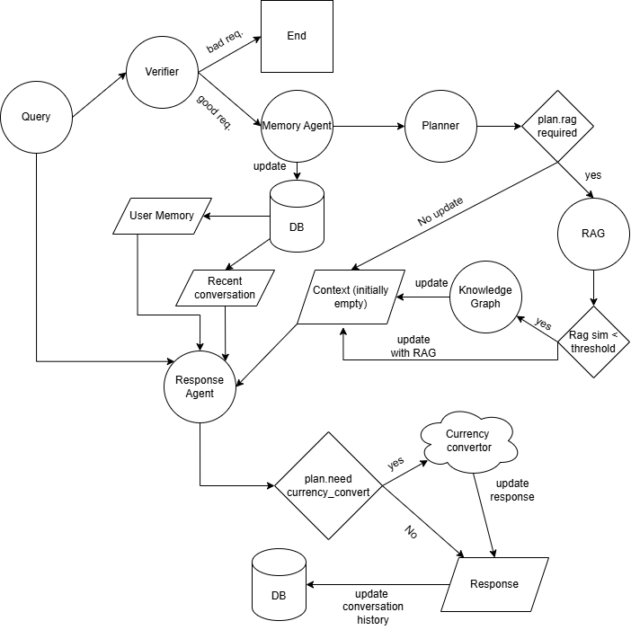

# ML-Industry AWS Billing Assistant (Multi-Agent LLM System)

A course project implementing a multi-agent system (MAS) for AWS billing / cost-management Q&A with:
- RAG over AWS billing PDFs (FAISS vector store)
- Optional Knowledge Graph retrieval (Neo4j)
- Tool-planning agent that chooses between tools dynamically
- Short-term + long-term memory
- Escalation analysis (P0/P1/P2/NONE)
- FastAPI backend + Web UI + Admin UI + tracing

---

# Project goal & use case

Goal: Provide grounded, actionable answers to AWS billing questions (payments, invoices, taxes, CUR, cost allocation, etc.) by combining LLM reasoning with retrieval and tools.

Use case examples
- “Why is my AWS bill higher this month?”
- “How do I enable Cost and Usage Reports (CUR)?”
- “Where can I add/change payment method in Billing?”
- “I need to pay 100 USD but I only have JPY—how much is that today?”

---

# System architecture

### Agents
- ResponseAgent (agents/response_agent.py)
  - Produces the final answer.
  - Executes the tool plan (RAG/KG/currency conversion) and composes citations.
- ToolPlannerAgent (agents/tool_planner_agent.py)
  - Decides which tool(s) to call and returns a structured ToolPlan (Pydantic-validated).
- UserMemoryAgent (agents/memory_agent.py)
  - Extracts and stores durable user facts (long-term memory).
- EscalationAgent (agents/escalation_agent.py)
  - Assigns escalation priority (P0/P1/P2/NONE) and generates a human summary.
- Guards / Intent Classifier (agents/guards.py, safety.py)
  - Detects prompt injection patterns and keeps the assistant in-domain.

### Tools
- RAG retrieval (rag/faiss_store.py) — FAISS vector store over local PDFs
- Knowledge Graph retrieval (optional) (rag/knowledge_graph_agent.py) — Neo4j-based context expansion
- Currency FX tool (tools/currency_fx_tool.py) — live FX rates with retries/timeouts and fallback provider
- Currency calculator (tools/calculator_tool.py) — deterministic numeric conversion/rounding

### Memory
- Short-term memory: recent conversation messages passed into the agents (MAX_HISTORY_MESSAGES)
- Long-term memory: SQLite via SQLModel (db.py) stored as durable “facts” per user

### Orchestration / communication flow
The backend orchestrator is the /chat endpoint in app.py.

High-level flow:
1. Auth (API token)
2. Guards (prompt injection + intent)
3. Load short-term context (conversation history)
4. UserMemoryAgent (update long-term memory facts)
5. ToolPlannerAgent (choose tools → ToolPlan)
6. Tool execution (RAG / KG / FX / calculator)
7. ResponseAgent generates final answer (+ citations)
8. EscalationAgent assigns P0/P1/P2/NONE
9. Tracing saved for inspection in Admin UI

---

# Tech stack

- FastAPI backend + Swagger UI
- LangChain (ChatOpenAI) for LLM calls
- FAISS for vector retrieval
- Neo4j (optional) for knowledge graph retrieval
- SQLite + SQLModel for persistence (users, conversations, messages, memory, traces, escalations)
- Docker / docker-compose for reproducible deployment

---

# AI Agent Workflow

## 1. Query Ingestion & Safety Filtering
- The user’s query is first evaluated by a **suspiciousness classifier**.
- If the query is flagged as **suspicious**, processing is **terminated immediately**.
- Otherwise, the query proceeds to the next stage.

## 2. Memory Extraction & Update
- A **Memory Agent** analyzes the query for **globally relevant user information**, such as:
  - Preferred language
  - Country of residence
  - Technical or workflow preferences
- If new or updated global metadata is detected:
  - It is **stored or updated** in the user’s persistent memory profile in the database.
  - Future interactions can leverage this enriched context.

## 3. Task Planning
- A **Planner Agent** interprets the query and determines:
  - Whether **external information** is required.
  - Which **tools** must be invoked (e.g., RAG, Knowledge Graph, Currency API).
  - The **execution order** of those tools.
- The Planner’s decision drives the entire downstream workflow.

## 4. Context Retrieval
- If external context is needed:
  1. The system first queries a **Retrieval-Augmented Generation (RAG)** module.
  2. If the **top retrieval similarity score** is **below a configurable threshold**:
     - The system **falls back** to querying a **Knowledge Graph** for complementary structured knowledge.
- This two-tier retrieval strategy balances semantic relevance with factual reliability.

## 5. Response Synthesis
- The **Response Agent** assembles a unified context bundle containing:
  - Retrieved external information (from RAG or Knowledge Graph)
  - Relevant entries from the user’s **memory profile**
  - The **latest conversation history**
  - The original **user query**
- If instructed by the Planner, the Response Agent may also:
  - Call the **Currency Exchange API** (or other real-time data sources) to fetch up-to-date information.

## 6. User Response Generation
- Using the enriched context, the Response Agent **generates a clear, personalized, and accurate response**.
- The final answer is delivered to the user, completing the interaction loop.

# Diagram and system flow

# Running locally (Python)

### 1) Install dependencies
please check instructions.txt and instructions_docker.txt

